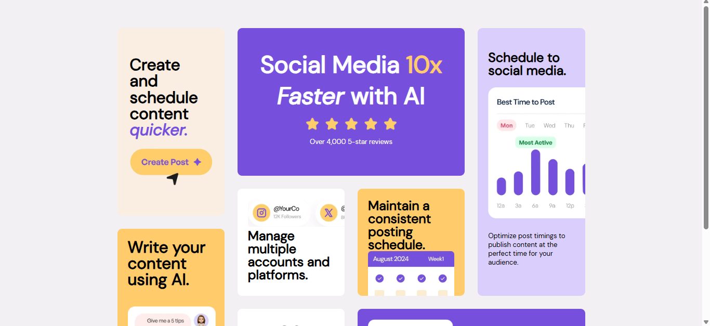

# Frontend Mentor - Bento grid solution

This is a solution to the [Bento grid challenge on Frontend Mentor](https://www.frontendmentor.io/challenges/bento-grid-RMydElrlOj). Frontend Mentor challenges help you improve your coding skills by building realistic projects. 

## Table of contents

- [Overview](#overview)
  - [The challenge](#the-challenge)
  - [Screenshot](#screenshot)
  - [Links](#links)
- [My process](#my-process)
  - [Built with](#built-with)
  - [What I learned](#what-i-learned)
  - [Continued development](#continued-development)
  - [Useful resources](#useful-resources)
- [Author](#author)
- [Acknowledgments](#acknowledgments)

**Note: Delete this note and update the table of contents based on what sections you keep.**

## Overview

### The challenge

Users should be able to:

- View the optimal layout for the interface depending on their device's screen size

### Screenshot

### Links

- Live Site URL: [Live site](https://bento-grid-main-rust.vercel.app/)

## My process

### Built with

- Semantic HTML5 markup
- CSS custom properties
- CSS Grid
- Mobile-first workflow

### What I learned

I learned that using a mobile-first workflow and scaling up from there, is often the best way to design responsive CSS layouts. I also learned how to use the grid-column and grid-row CSS properties to move about grid items in a grid and to resize them. Additionally, I learned how to use media queries to create different page layouts for different screen sizes. Overall this allowed to get my first taste in CSS Grid layout and how it can be used to create responsive and dynamic web pages.

### Continued development

I would like to use a CSS grid layout again, but not for a Mansory style this time around. Maybe try out a "Holy Grail" style layout or "Multi-column". Also I want to create more responsive layouts using media queries and be more compliant with WGAC guidelines.

### Useful resources

- [Build Layouts with CSS Grid](https://www.youtube.com/watch?v=xPuYbmmPdEM&list=PL4cUxeGkcC9hk02lFb6EkdXF2DYGl4Gg4) - Net Ninja's Grid CSS Layout crash course was without a doubt the best resource on the topic anywhere online. I look forward to using him in future projects.

## Author

- Frontend Mentor - [@ginikaifeanyi88-web](https://www.frontendmentor.io/profile/ginikaifeanyi88-web
